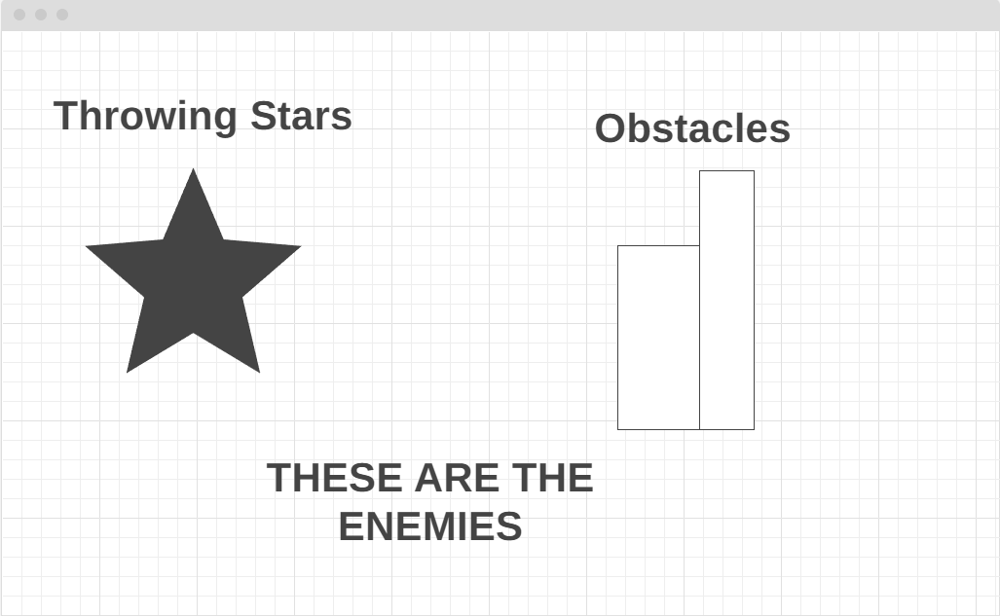

# Ninja Run Game
### 3/7/2024
## By: Corey Cameron
[Link](https://github.com/nottmonk) [link](https://www.linkedin.com/in/corey-cameron-319873221/)

# Description

A game where a has to run and jump and dodge diffrent obsticles 

# Psuedocode
- Basic movement of the game need to have running and jumping(maybe ducking)

- Game also needs to consist of character or obstacles to create a challange

- Score needs to be created and need to be held and have a function that tell the game if reached a certain score increase game speed(Increase how fast the obstacles come at character) 

- If ninja(main charater) get hit by obstacles then game over and log current score and highest score

- score counting function

- function that notify's player has beat previous highest score

- Start over function needs to be created that saves highscore

### WireFrame
[Link](https://wireframe.cc/BUfQ9Q)

  

